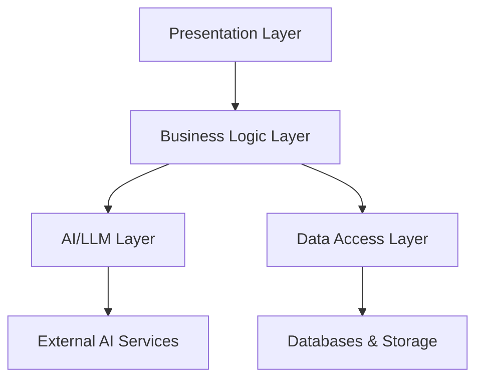

# Best Practices


## Overview

Building production-ready AI agents requires more than just functional code. This guide covers essential best practices for creating robust, maintainable, and trustworthy AI systems.

## Design Principles

### 1. Separation of Concerns

Organize your agent into distinct layers:



**Benefits:**
- Easier testing and debugging
- Better maintainability
- Flexible component replacement
- Clear boundaries and responsibilities

### 2. Fail Gracefully

Always handle errors appropriately:

=== "Python"

    ```python
    class AgentOrchestrator:
        def process_request(self, request):
            try:
                # Validate input
                validated_input = self.validate_input(request)

                # Process with AI
                response = self.ai_agent.process(validated_input)

                # Validate output
                validated_output = self.validate_output(response)

                return {
                    "success": True,
                    "data": validated_output
                }

            except ValidationError as e:
                return {
                    "success": False,
                    "error": "Invalid input",
                    "message": str(e)
                }
            except AIServiceError as e:
                # Log error for monitoring
                self.logger.error(f"AI service error: {e}")
                return {
                    "success": False,
                    "error": "Service temporarily unavailable",
                    "fallback": self.get_fallback_response()
                }
            except Exception as e:
                # Catch-all for unexpected errors
                self.logger.critical(f"Unexpected error: {e}")
                return {
                    "success": False,
                    "error": "An error occurred"
                }
    ```

### 3. Idempotency

Ensure operations can be safely retried:

```python
class IdempotentAgent:
    def __init__(self):
        self.request_cache = {}

    def process_with_idempotency(self, request_id, input_data):
        # Check if request was already processed
        if request_id in self.request_cache:
            return self.request_cache[request_id]

        # Process the request
        result = self.process(input_data)

        # Cache the result
        self.request_cache[request_id] = result

        return result
```

## Prompt Engineering

### Write Effective Prompts

!!! tip "Prompt Structure"
    A well-structured prompt includes:
    1. Role/persona definition
    2. Context and constraints
    3. Task description
    4. Output format specification
    5. Examples (few-shot learning)

#### Example: Structured Prompt

```python
def create_analysis_prompt(data, constraints):
    return f"""
    You are an expert data analyst specializing in business intelligence.

    CONTEXT:
    - Company: Enterprise Software Solutions
    - Department: Sales Analytics
    - Time Period: Q4 2024

    CONSTRAINTS:
    - Use only the provided data
    - Highlight trends and anomalies
    - Provide actionable recommendations
    - Keep analysis under 500 words

    DATA:
    {data}

    TASK:
    Analyze the sales data and provide:
    1. Key insights (3-5 bullet points)
    2. Trends observed
    3. Recommendations for improvement

    OUTPUT FORMAT:
    ## Key Insights
    - [insight 1]
    - [insight 2]

    ## Trends
    [trends description]

    ## Recommendations
    1. [recommendation 1]
    2. [recommendation 2]
    """
```

### Prompt Versioning

Maintain versions of your prompts:

```python
PROMPTS = {
    "customer_service_v1": """You are a helpful customer service agent...""",
    "customer_service_v2": """You are a professional customer service representative with expertise in...""",
    "current": "customer_service_v2"
}

def get_prompt(version="current"):
    if version == "current":
        version = PROMPTS["current"]
    return PROMPTS.get(version)
```

## Performance Optimization

### 1. Caching Strategies

Implement intelligent caching:

```python
from functools import lru_cache
import hashlib

class SmartCache:
    def __init__(self, ttl=3600):
        self.cache = {}
        self.ttl = ttl

    def get_cache_key(self, prompt, parameters):
        # Create deterministic cache key
        content = f"{prompt}:{str(sorted(parameters.items()))}"
        return hashlib.sha256(content.encode()).hexdigest()

    def get_or_compute(self, prompt, parameters, compute_fn):
        cache_key = self.get_cache_key(prompt, parameters)

        if cache_key in self.cache:
            cached_result, timestamp = self.cache[cache_key]
            if time.time() - timestamp < self.ttl:
                return cached_result

        # Compute new result
        result = compute_fn(prompt, parameters)
        self.cache[cache_key] = (result, time.time())

        return result
```

### 2. Async Processing

Use asynchronous patterns for better throughput:

```python
import asyncio
from typing import List

class AsyncAgent:
    async def process_batch(self, requests: List[str]):
        # Process multiple requests concurrently
        tasks = [self.process_single(req) for req in requests]
        results = await asyncio.gather(*tasks, return_exceptions=True)

        return [
            result if not isinstance(result, Exception) else None
            for result in results
        ]

    async def process_single(self, request):
        # Your async processing logic
        pass
```

### 3. Request Batching

Batch similar requests for efficiency:

```python
class BatchProcessor:
    def __init__(self, batch_size=10, max_wait=1.0):
        self.batch_size = batch_size
        self.max_wait = max_wait
        self.queue = []
        self.results = {}

    async def add_request(self, request_id, request):
        self.queue.append((request_id, request))

        if len(self.queue) >= self.batch_size:
            await self.process_batch()

        return await self.wait_for_result(request_id)
```

## Observability and Monitoring

### Comprehensive Logging

```python
import logging
from datetime import datetime

class AgentLogger:
    def __init__(self):
        self.logger = logging.getLogger("AIAgent")

    def log_request(self, request_id, user_id, input_data):
        self.logger.info({
            "event": "request_received",
            "request_id": request_id,
            "user_id": user_id,
            "timestamp": datetime.utcnow().isoformat(),
            "input_length": len(str(input_data))
        })

    def log_response(self, request_id, response, duration_ms):
        self.logger.info({
            "event": "response_sent",
            "request_id": request_id,
            "timestamp": datetime.utcnow().isoformat(),
            "duration_ms": duration_ms,
            "output_length": len(str(response))
        })

    def log_error(self, request_id, error, context):
        self.logger.error({
            "event": "error_occurred",
            "request_id": request_id,
            "error_type": type(error).__name__,
            "error_message": str(error),
            "context": context,
            "timestamp": datetime.utcnow().isoformat()
        })
```

### Metrics Collection

Track important metrics:

```python
class AgentMetrics:
    def __init__(self):
        self.metrics = {
            "total_requests": 0,
            "successful_requests": 0,
            "failed_requests": 0,
            "avg_response_time_ms": 0,
            "errors_by_type": {}
        }

    def record_success(self, duration_ms):
        self.metrics["total_requests"] += 1
        self.metrics["successful_requests"] += 1
        self.update_avg_response_time(duration_ms)

    def record_failure(self, error_type):
        self.metrics["total_requests"] += 1
        self.metrics["failed_requests"] += 1
        self.metrics["errors_by_type"][error_type] = \
            self.metrics["errors_by_type"].get(error_type, 0) + 1
```

## Testing Strategies

### Unit Tests

```python
import pytest
from unittest.mock import Mock, patch

class TestAIAgent:
    @pytest.fixture
    def agent(self):
        return AIAgent()

    def test_input_validation(self, agent):
        # Test valid input
        valid_input = "What are your business hours?"
        assert agent.validate_input(valid_input) == True

        # Test invalid input
        invalid_input = "x" * 10000  # Too long
        assert agent.validate_input(invalid_input) == False

    @patch('ai_agent.llm_service.call')
    def test_response_generation(self, mock_llm, agent):
        # Mock LLM response
        mock_llm.return_value = "Our business hours are 9 AM to 5 PM."

        response = agent.generate_response("What are your business hours?")

        assert "9 AM to 5 PM" in response
        mock_llm.assert_called_once()
```

### Integration Tests

```python
class TestAgentIntegration:
    def test_end_to_end_flow(self):
        agent = AIAgent()

        # Test complete workflow
        request = {
            "user_id": "test_user",
            "question": "How do I reset my password?"
        }

        response = agent.process_request(request)

        assert response["success"] == True
        assert "password" in response["data"].lower()
        assert len(response["data"]) > 0
```

## Documentation

### Code Documentation

```python
class DocumentedAgent:
    """
    An AI agent that processes customer service requests.

    This agent uses Azure OpenAI for natural language understanding
    and generation. It includes safety filters, rate limiting, and
    comprehensive logging.

    Attributes:
        kernel (Kernel): Semantic Kernel instance
        safety_filter (SafetyFilter): Input/output validation
        cache (SmartCache): Response caching system

    Example:
        >>> agent = DocumentedAgent()
        >>> response = agent.process("What are your hours?")
        >>> print(response)
    """

    def process(self, user_input: str) -> str:
        """
        Process a user request and return a response.

        Args:
            user_input (str): The user's question or request

        Returns:
            str: The agent's response

        Raises:
            ValidationError: If input fails validation
            AIServiceError: If the AI service is unavailable

        Example:
            >>> agent.process("Hello!")
            "Hello! How can I help you today?"
        """
        pass
```

## Configuration Management

Use configuration files for flexibility:

```yaml
# config/agent_config.yaml
agent:
  name: "Customer Service Agent"
  version: "1.0.0"

  model:
    provider: "azure_openai"
    deployment: "gpt-4"
    temperature: 0.7
    max_tokens: 1000

  safety:
    max_input_length: 1000
    max_output_length: 2000
    content_filter_enabled: true

  performance:
    cache_ttl: 3600
    max_concurrent_requests: 10
    timeout_seconds: 30

  monitoring:
    log_level: "INFO"
    metrics_enabled: true
    tracing_enabled: true
```

<div class="resource-links">
<h3>📚 Microsoft Learn Resources</h3>
<ul>
<li><a href="https://learn.microsoft.com/azure/ai-services/openai/concepts/best-practices" target="_blank" rel="noopener">Azure AI Best Practices</a></li>
<li><a href="https://learn.microsoft.com/azure/ai-services/openai/concepts/advanced-prompt-engineering" target="_blank" rel="noopener">Prompt Engineering Guide</a></li>
<li><a href="https://learn.microsoft.com/azure/ai-services/openai/how-to/performance" target="_blank" rel="noopener">Performance Optimization</a></li>
<li><a href="https://learn.microsoft.com/azure/ai-services/openai/how-to/monitoring" target="_blank" rel="noopener">Monitoring AI Applications</a></li>
</ul>
<h3>📖 Additional Documentation</h3>
<ul>
<li><a href="https://docs.microsoft.com/azure/architecture/best-practices/testing" target="_blank" rel="noopener">Testing Best Practices</a></li>
<li><a href="https://docs.microsoft.com/azure/azure-monitor/app/app-insights-overview" target="_blank" rel="noopener">Application Insights</a></li>
<li><a href="https://docs.microsoft.com/azure/architecture/patterns/" target="_blank" rel="noopener">Azure Architecture Patterns</a></li>
</ul>
</div>
