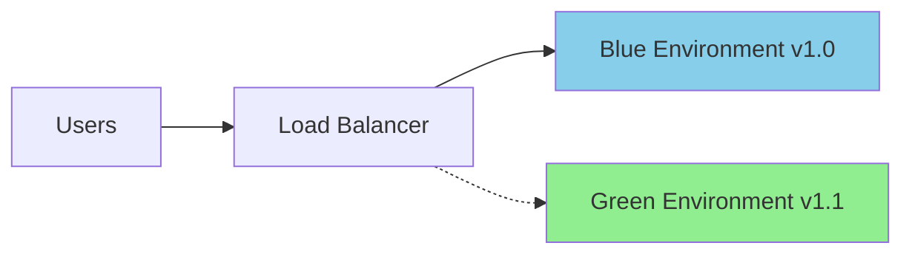

# Deployment Strategies


## Overview

Deploying AI agents to production requires careful planning and consideration of various deployment patterns, infrastructure requirements, and operational procedures. This guide covers proven strategies for deploying trustworthy AI agents at scale.

## Deployment Patterns

### 1. Azure Container Apps

Deploy your agent as a containerized application for maximum flexibility and scalability.

```dockerfile
# Dockerfile
FROM python:3.11-slim

WORKDIR /app

# Install dependencies
COPY requirements.txt .
RUN pip install --no-cache-dir -r requirements.txt

# Copy application code
COPY . .

# Expose port
EXPOSE 8000

# Run the application
CMD ["uvicorn", "main:app", "--host", "0.0.0.0", "--port", "8000"]
```

**Benefits:**
- Easy scaling (horizontal and vertical)
- Consistent environments
- Fast deployments and rollbacks
- Built-in load balancing

**Deployment:**

```bash
# Build container
az acr build --registry myregistry --image ai-agent:v1 .

# Deploy to Container Apps
az containerapp create \
  --name my-ai-agent \
  --resource-group my-rg \
  --image myregistry.azurecr.io/ai-agent:v1 \
  --environment my-env \
  --ingress external \
  --target-port 8000
```

### 2. Azure Functions

Serverless deployment for event-driven and cost-effective solutions.

```python
import azure.functions as func
import logging

app = func.FunctionApp()

@app.function_name(name="ProcessRequest")
@app.route(route="agent", methods=["POST"], auth_level=func.AuthLevel.FUNCTION)
async def process_request(req: func.HttpRequest) -> func.HttpResponse:
    logging.info('AI Agent processing request')
    
    try:
        # Get request data
        req_body = req.get_json()
        user_input = req_body.get('input')
        
        # Process with agent
        agent = AIAgent()
        response = await agent.process(user_input)
        
        return func.HttpResponse(
            json.dumps({"response": response}),
            mimetype="application/json"
        )
    except Exception as e:
        logging.error(f"Error: {str(e)}")
        return func.HttpResponse(
            json.dumps({"error": "Processing failed"}),
            status_code=500
        )
```

**Benefits:**
- Pay only for execution time
- Automatic scaling
- No infrastructure management
- Event-driven architecture

### 3. Azure Kubernetes Service (AKS)

For enterprise-grade deployments with complex requirements.

```yaml
# deployment.yaml
apiVersion: apps/v1
kind: Deployment
metadata:
  name: ai-agent
spec:
  replicas: 3
  selector:
    matchLabels:
      app: ai-agent
  template:
    metadata:
      labels:
        app: ai-agent
    spec:
      containers:
      - name: ai-agent
        image: myregistry.azurecr.io/ai-agent:v1
        ports:
        - containerPort: 8000
        env:
        - name: AZURE_OPENAI_ENDPOINT
          valueFrom:
            secretKeyRef:
              name: ai-agent-secrets
              key: openai-endpoint
        resources:
          requests:
            memory: "512Mi"
            cpu: "500m"
          limits:
            memory: "1Gi"
            cpu: "1000m"
---
apiVersion: v1
kind: Service
metadata:
  name: ai-agent-service
spec:
  selector:
    app: ai-agent
  ports:
  - port: 80
    targetPort: 8000
  type: LoadBalancer
```

**Benefits:**
- Full control over orchestration
- Advanced networking capabilities
- Custom scaling policies
- Multi-cluster deployments

## Blue-Green Deployment

Minimize downtime and risk with blue-green deployments:



**Implementation:**

```bash
# Deploy new version (green)
az containerapp create \
  --name ai-agent-green \
  --resource-group my-rg \
  --image myregistry.azurecr.io/ai-agent:v2

# Test green environment
curl https://ai-agent-green.azurecontainerapps.io/health

# Switch traffic to green
az containerapp ingress traffic set \
  --name ai-agent \
  --resource-group my-rg \
  --revision-weight ai-agent-green=100 ai-agent-blue=0

# After validation, decommission blue
az containerapp revision deactivate \
  --name ai-agent \
  --resource-group my-rg \
  --revision ai-agent-blue
```

## Canary Deployment

Gradual rollout to minimize risk:

```bash
# Initial deployment - 10% traffic to new version
az containerapp ingress traffic set \
  --name ai-agent \
  --resource-group my-rg \
  --revision-weight latest=10 stable=90

# Monitor metrics and gradually increase

# 50% traffic
az containerapp ingress traffic set \
  --revision-weight latest=50 stable=50

# 100% traffic after validation
az containerapp ingress traffic set \
  --revision-weight latest=100
```

## Infrastructure as Code

### Bicep Template

```bicep
param location string = resourceGroup().location
param agentName string = 'ai-agent'

resource containerApp 'Microsoft.App/containerApps@2023-05-01' = {
  name: agentName
  location: location
  properties: {
    configuration: {
      ingress: {
        external: true
        targetPort: 8000
        allowInsecure: false
      }
      secrets: [
        {
          name: 'openai-key'
          value: openAIKey
        }
      ]
    }
    template: {
      containers: [
        {
          name: 'ai-agent'
          image: 'myregistry.azurecr.io/ai-agent:latest'
          env: [
            {
              name: 'AZURE_OPENAI_KEY'
              secretRef: 'openai-key'
            }
          ]
          resources: {
            cpu: json('0.5')
            memory: '1Gi'
          }
        }
      ]
      scale: {
        minReplicas: 1
        maxReplicas: 10
        rules: [
          {
            name: 'http-scaling'
            http: {
              metadata: {
                concurrentRequests: '50'
              }
            }
          }
        ]
      }
    }
  }
}
```

### Terraform

```hcl
resource "azurerm_container_app" "ai_agent" {
  name                = "ai-agent"
  resource_group_name = azurerm_resource_group.main.name
  container_app_environment_id = azurerm_container_app_environment.main.id
  revision_mode = "Single"

  template {
    container {
      name   = "ai-agent"
      image  = "myregistry.azurecr.io/ai-agent:latest"
      cpu    = 0.5
      memory = "1Gi"

      env {
        name        = "AZURE_OPENAI_ENDPOINT"
        secret_name = "openai-endpoint"
      }
    }

    min_replicas = 1
    max_replicas = 10
  }

  ingress {
    external_enabled = true
    target_port      = 8000
    
    traffic_weight {
      percentage      = 100
      latest_revision = true
    }
  }
}
```

## Scaling Strategies

### Auto-scaling Configuration

```yaml
# Container Apps auto-scaling
scale:
  minReplicas: 2
  maxReplicas: 20
  rules:
  - name: http-rule
    http:
      metadata:
        concurrentRequests: "50"
  - name: cpu-rule
    custom:
      type: cpu
      metadata:
        type: Utilization
        value: "70"
```

### Load Testing

Validate your scaling configuration:

```python
import asyncio
import aiohttp
from datetime import datetime

async def load_test(url, num_requests, concurrency):
    async with aiohttp.ClientSession() as session:
        start_time = datetime.now()
        
        async def make_request(i):
            try:
                async with session.post(
                    url,
                    json={"input": f"Test request {i}"},
                    timeout=aiohttp.ClientTimeout(total=30)
                ) as response:
                    return await response.json()
            except Exception as e:
                return {"error": str(e)}
        
        # Create batches for concurrent execution
        tasks = []
        for batch_start in range(0, num_requests, concurrency):
            batch_end = min(batch_start + concurrency, num_requests)
            batch_tasks = [
                make_request(i) 
                for i in range(batch_start, batch_end)
            ]
            results = await asyncio.gather(*batch_tasks)
            tasks.extend(results)
        
        duration = (datetime.now() - start_time).total_seconds()
        success_count = sum(1 for r in tasks if "error" not in r)
        
        print(f"Total requests: {num_requests}")
        print(f"Successful: {success_count}")
        print(f"Failed: {num_requests - success_count}")
        print(f"Duration: {duration:.2f}s")
        print(f"RPS: {num_requests/duration:.2f}")

# Run load test
asyncio.run(load_test(
    url="https://ai-agent.azurecontainerapps.io/process",
    num_requests=1000,
    concurrency=50
))
```

## Health Checks and Monitoring

### Health Check Endpoint

```python
from fastapi import FastAPI, status
from datetime import datetime

app = FastAPI()

@app.get("/health", status_code=status.HTTP_200_OK)
async def health_check():
    """
    Health check endpoint for container orchestration.
    """
    try:
        # Check dependencies
        await check_database()
        await check_ai_service()
        
        return {
            "status": "healthy",
            "timestamp": datetime.utcnow().isoformat(),
            "version": "1.0.0"
        }
    except Exception as e:
        return {
            "status": "unhealthy",
            "error": str(e),
            "timestamp": datetime.utcnow().isoformat()
        }

@app.get("/ready")
async def readiness_check():
    """
    Readiness check to determine if app can accept traffic.
    """
    return {"ready": True}
```

### Application Insights Integration

```python
from azure.monitor.opentelemetry import configure_azure_monitor
from opentelemetry import trace
from opentelemetry.instrumentation.fastapi import FastAPIInstrumentor

# Configure Azure Monitor
configure_azure_monitor(
    connection_string="InstrumentationKey=your-key"
)

# Instrument FastAPI
FastAPIInstrumentor.instrument_app(app)

# Use tracing
tracer = trace.get_tracer(__name__)

@app.post("/process")
async def process_request(request: dict):
    with tracer.start_as_current_span("process_request") as span:
        span.set_attribute("user_id", request.get("user_id"))
        
        # Your processing logic
        result = await agent.process(request["input"])
        
        span.set_attribute("response_length", len(result))
        return {"response": result}
```

## Security in Deployment

### Managed Identity

```python
from azure.identity import DefaultAzureCredential
from azure.keyvault.secrets import SecretClient

# Use managed identity instead of API keys
credential = DefaultAzureCredential()
client = SecretClient(
    vault_url="https://myvault.vault.azure.net/",
    credential=credential
)

# Retrieve secrets
openai_key = client.get_secret("openai-api-key").value
```

### Network Isolation

```bicep
resource vnet 'Microsoft.Network/virtualNetworks@2021-05-01' = {
  name: 'ai-agent-vnet'
  location: location
  properties: {
    addressSpace: {
      addressPrefixes: ['10.0.0.0/16']
    }
    subnets: [
      {
        name: 'agent-subnet'
        properties: {
          addressPrefix: '10.0.1.0/24'
          delegations: [
            {
              name: 'containerAppsDelegation'
              properties: {
                serviceName: 'Microsoft.App/environments'
              }
            }
          ]
        }
      }
    ]
  }
}
```

## CI/CD Pipeline

### GitHub Actions Example

```yaml
name: Deploy AI Agent

on:
  push:
    branches: [main]

jobs:
  build-and-deploy:
    runs-on: ubuntu-latest
    
    steps:
    - uses: actions/checkout@v3
    
    - name: Login to Azure
      uses: azure/login@v1
      with:
        creds: ${{ secrets.AZURE_CREDENTIALS }}
    
    - name: Build and push image
      run: |
        az acr build \
          --registry ${{ secrets.ACR_NAME }} \
          --image ai-agent:${{ github.sha }} \
          --file Dockerfile .
    
    - name: Deploy to Container Apps
      run: |
        az containerapp update \
          --name ai-agent \
          --resource-group ${{ secrets.RESOURCE_GROUP }} \
          --image ${{ secrets.ACR_NAME }}.azurecr.io/ai-agent:${{ github.sha }}
    
    - name: Run health check
      run: |
        sleep 30
        curl -f https://ai-agent.azurecontainerapps.io/health || exit 1
```

## Rollback Procedures

Always have a rollback plan:

```bash
# List revisions
az containerapp revision list \
  --name ai-agent \
  --resource-group my-rg

# Rollback to previous revision
az containerapp revision activate \
  --name ai-agent \
  --resource-group my-rg \
  --revision ai-agent--previous-revision

# Set traffic to previous version
az containerapp ingress traffic set \
  --name ai-agent \
  --resource-group my-rg \
  --revision-weight ai-agent--previous=100
```

<div class="resource-links">

### 📚 Microsoft Learn Resources

- [Azure Container Apps Documentation](https://learn.microsoft.com/azure/container-apps/)
- [Azure Functions for Python](https://learn.microsoft.com/azure/azure-functions/functions-reference-python)
- [AKS Best Practices](https://learn.microsoft.com/azure/aks/best-practices)
- [CI/CD for Azure](https://learn.microsoft.com/azure/devops/pipelines/)
- [Azure Monitor and Application Insights](https://learn.microsoft.com/azure/azure-monitor/)

### 📖 Additional Documentation

- [Container Apps Deployment](https://docs.microsoft.com/azure/container-apps/deploy)
- [Managed Identity Documentation](https://docs.microsoft.com/azure/active-directory/managed-identities-azure-resources/)
- [Azure DevOps Documentation](https://docs.microsoft.com/azure/devops/)

</div>
