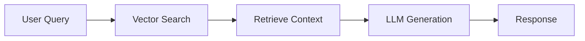
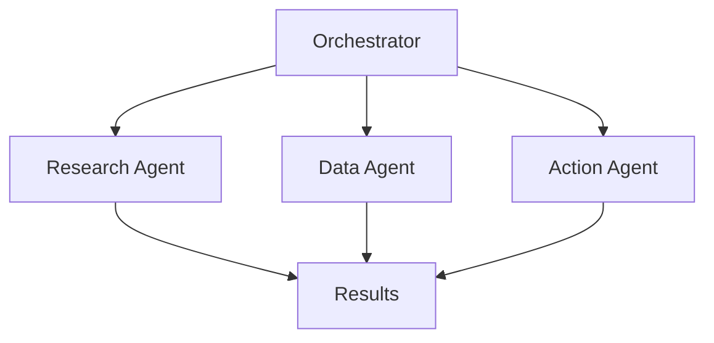
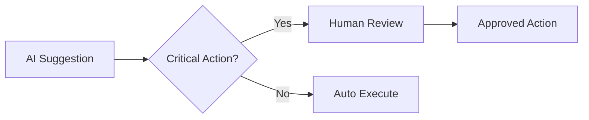

# Build & Deploy AI Agents


## Introduction

Building and deploying AI agents requires a comprehensive understanding of both the technical architecture and the operational considerations. This chapter will guide you through the essential components and best practices for creating safe and effective AI agents.

## What Are AI Agents?

AI agents are autonomous systems that can perceive their environment, make decisions, and take actions to achieve specific goals. Unlike traditional software, AI agents can:

- **Learn and adapt** from experience and new data
- **Make autonomous decisions** based on their training and context
- **Interact naturally** with users through conversational interfaces
- **Orchestrate complex workflows** across multiple systems
- **Provide intelligent recommendations** and insights

## Core Components of AI Agents

### 1. Reasoning Engine

The reasoning engine is the "brain" of your AI agent. It processes inputs, applies logic, and determines appropriate actions.

```python
# Example: Simple reasoning flow
class ReasoningEngine:
    def process(self, user_input, context):
        # Analyze intent
        intent = self.analyze_intent(user_input)

        # Retrieve relevant context
        relevant_data = self.retrieve_context(intent, context)

        # Generate response
        response = self.generate_response(intent, relevant_data)

        return response
```

### 2. Knowledge Base

The knowledge base stores information that your agent can access to provide accurate and relevant responses.

- **Vector databases** for semantic search
- **Document stores** for structured information
- **Graph databases** for relationship mapping
- **Cache layers** for performance optimization

### 3. Action Executors

Action executors enable your agent to perform tasks and interact with external systems.

```python
# Example: Action executor interface
class ActionExecutor:
    def execute(self, action_name, parameters):
        if action_name == "query_database":
            return self.query_database(parameters)
        elif action_name == "send_email":
            return self.send_email(parameters)
        # Add more actions as needed
```
**Context: What is an Action Executor in Azure AI Agents?**
An action executor is a component or module responsible for carrying out actions—whether that’s calling an API, modifying data, or triggering workflows—on behalf of the AI agent. This means that whenever an agent determines via reasoning or policy that something should be done, the action executor handles the “doing.”

**Key Considerations for Action Executors**
1. Agent Identity
What: This refers to how the agent is identified to the systems where actions are being executed. In Azure, this is often a managed identity, service principal, or a user context delegated to the agent.
Why: Identity is crucial for auditing (knowing which agent did what), applying the right policies, and mapping action execution to individual agents or agent types.
How: Use Azure Active Directory identities, Managed Identities for Azure resources, or assign custom identities.
2. Permissions and Controls
What: Permissions determine what actions the agent is allowed to execute (e.g., read/write access to resources, invoking functions, etc.).
Why: Security is critical—agents should only execute actions they are authorized for, to mitigate risks of over-permissioned automation and to comply with least-privilege principles.
How: Use Azure Role-Based Access Control (RBAC) or fine-grained policy controls to restrict what an agent’s identity can do. You can also use custom policies or scopes per action type.
3. Controls (Governance, Auditing, and Monitoring)
What: Controls refer to additional checks, logging, approvals, and monitoring applied to agent actions.
Why: Organizational requirements, compliance, and operational safety often require detailed tracking and sometimes human-in-the-loop approvals for sensitive actions.
How: Enable Azure Monitor logs, set up activity logs, and (if needed) integrate with workflows that require approval for certain action types before execution.  


### 4. Safety Layers

Critical for trustworthy AI agents, safety layers ensure that actions are appropriate and secure.

- Input validation and sanitization
- Output filtering and content safety
- Rate limiting and resource management
- Audit logging and monitoring


*Figure: Key practices for operationalizing trust in AI systems*

## Architecture Patterns

### Pattern 1: Retrieval-Augmented Generation (RAG)

RAG combines the power of large language models with external knowledge sources.



**Benefits:**
- Reduces hallucinations
- Keeps information current
- Enables domain-specific knowledge

### Pattern 2: Multi-Agent Systems

Coordinate multiple specialized agents for complex tasks.



**Benefits:**
- Specialization and expertise
- Parallel processing
- Modular and maintainable

### Pattern 3: Human-in-the-Loop

Incorporate human oversight for critical decisions.



**Benefits:**
- Enhanced safety and reliability
- Improved accuracy over time
- Regulatory compliance

## Key Considerations

!!! warning "Performance vs. Safety Trade-offs"
    Always prioritize safety over speed. A slower, correct response is better than a fast, incorrect one.

!!! info "Scalability Planning"
    Design your agent architecture to scale from day one. Consider:
    - Load balancing strategies
    - Caching mechanisms
    - Async processing patterns
    - Resource quotas

!!! tip "Observability"
    Implement comprehensive logging and monitoring:
    - Request/response tracking
    - Performance metrics
    - Error rates and types
    - User interaction patterns

## Next Steps

Continue to the following sections to dive deeper into specific aspects of building and deploying AI agents:

- [Getting Started](getting-started.md) - Set up your development environment
- [Best Practices](best-practices.md) - Learn proven techniques and patterns
- [Deployment Strategies](deployment.md) - Deploy your agents effectively

<div class="resource-links">
<h3>📚 Microsoft Learn Resources</h3>
<ul>
<li><a href="https://learn.microsoft.com/azure/ai-studio/" target="_blank" rel="noopener">Microsoft Foundry</a></li>
<li><a href="https://learn.microsoft.com/semantic-kernel/" target="_blank" rel="noopener">Semantic Kernel</a></li>
<li><a href="https://microsoftlearning.github.io/mslearn-ai-agents/" target="_blank" rel="noopener">Develop AI Agents in Azure</a></li>
</ul>
<h3>📖 Additional Documentation</h3>
<ul>
