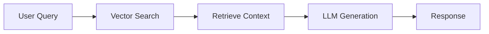
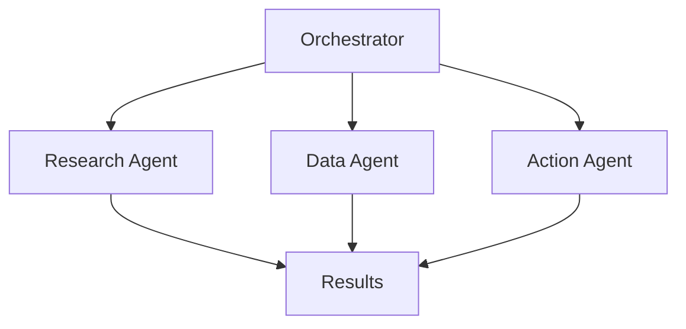
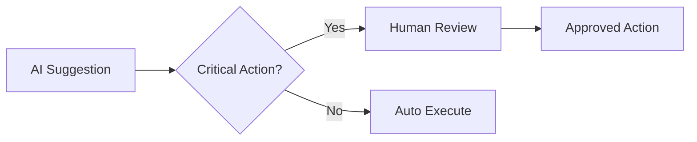

# Build & Deploy AI Agents


## Introduction

Building and deploying AI agents requires a comprehensive understanding of both the technical architecture and the operational considerations. This chapter will guide you through the essential components and best practices for creating safe and effective AI agents.

## What Are AI Agents?

AI agents are autonomous systems that can perceive their environment, make decisions, and take actions to achieve specific goals. Unlike traditional software, AI agents can:

- **Learn and adapt** from experience and new data
- **Make autonomous decisions** based on their training and context
- **Interact naturally** with users through conversational interfaces
- **Orchestrate complex workflows** across multiple systems
- **Provide intelligent recommendations** and insights

## Core Components of AI Agents

### 1. Reasoning Engine

The reasoning engine is the "brain" of your AI agent. It processes inputs, applies logic, and determines appropriate actions.

```python
# Example: Simple reasoning flow
class ReasoningEngine:
    def process(self, user_input, context):
        # Analyze intent
        intent = self.analyze_intent(user_input)

        # Retrieve relevant context
        relevant_data = self.retrieve_context(intent, context)

        # Generate response
        response = self.generate_response(intent, relevant_data)

        return response
```

### 2. Knowledge Base

The knowledge base stores information that your agent can access to provide accurate and relevant responses.

- **Vector databases** for semantic search
- **Document stores** for structured information
- **Graph databases** for relationship mapping
- **Cache layers** for performance optimization

### 3. Action Executors

Action executors enable your agent to perform tasks and interact with external systems.

```python
# Example: Action executor interface
class ActionExecutor:
    def execute(self, action_name, parameters):
        if action_name == "query_database":
            return self.query_database(parameters)
        elif action_name == "send_email":
            return self.send_email(parameters)
        # Add more actions as needed
```

### 4. Safety Layers

Critical for trustworthy AI agents, safety layers ensure that actions are appropriate and secure.

- Input validation and sanitization
- Output filtering and content safety
- Rate limiting and resource management
- Audit logging and monitoring

## Architecture Patterns

### Pattern 1: Retrieval-Augmented Generation (RAG)

RAG combines the power of large language models with external knowledge sources.



**Benefits:**
- Reduces hallucinations
- Keeps information current
- Enables domain-specific knowledge

### Pattern 2: Multi-Agent Systems

Coordinate multiple specialized agents for complex tasks.



**Benefits:**
- Specialization and expertise
- Parallel processing
- Modular and maintainable

### Pattern 3: Human-in-the-Loop

Incorporate human oversight for critical decisions.



**Benefits:**
- Enhanced safety and reliability
- Improved accuracy over time
- Regulatory compliance

## Key Considerations

!!! warning "Performance vs. Safety Trade-offs"
    Always prioritize safety over speed. A slower, correct response is better than a fast, incorrect one.

!!! info "Scalability Planning"
    Design your agent architecture to scale from day one. Consider:
    - Load balancing strategies
    - Caching mechanisms
    - Async processing patterns
    - Resource quotas

!!! tip "Observability"
    Implement comprehensive logging and monitoring:
    - Request/response tracking
    - Performance metrics
    - Error rates and types
    - User interaction patterns

## Next Steps

Continue to the following sections to dive deeper into specific aspects of building and deploying AI agents:

- [Getting Started](getting-started.md) - Set up your development environment
- [Best Practices](best-practices.md) - Learn proven techniques and patterns
- [Deployment Strategies](deployment.md) - Deploy your agents effectively

<div class="resource-links">
<h3>📚 Microsoft Learn Resources</h3>
<ul>
<li><a href="https://learn.microsoft.com/azure/ai-studio/" target="_blank" rel="noopener">Build AI Apps with Azure AI Studio</a></li>
<li><a href="https://learn.microsoft.com/semantic-kernel/" target="_blank" rel="noopener">Develop AI Agents with Semantic Kernel</a></li>
<li><a href="https://learn.microsoft.com/azure/ai-services/agents/" target="_blank" rel="noopener">Azure AI Agent Service</a></li>
<li><a href="https://learn.microsoft.com/azure/ai-services/openai/concepts/prompt-engineering" target="_blank" rel="noopener">Prompt Engineering Techniques</a></li>
<li><a href="https://learn.microsoft.com/azure/search/retrieval-augmented-generation-overview" target="_blank" rel="noopener">RAG Pattern Implementation</a></li>
</ul>
<h3>📖 Additional Documentation</h3>
<ul>
<li><a href="https://docs.microsoft.com/azure/ai-services/sdks/" target="_blank" rel="noopener">Azure AI SDK Documentation</a></li>
<li><a href="https://learn.microsoft.com/semantic-kernel/" target="_blank" rel="noopener">Semantic Kernel Documentation</a></li>
<li><a href="https://docs.microsoft.com/azure/architecture/ai/" target="_blank" rel="noopener">Agent Architecture Patterns</a></li>
</ul>
</div>
