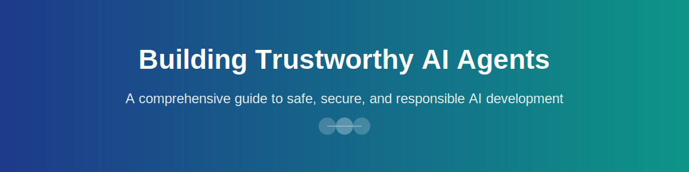

# Welcome to Building Trustworthy AI Agents

## Overview

Welcome to the comprehensive guide on building trustworthy AI agents. In today's rapidly evolving AI landscape, creating agents that are not only effective but also safe, secure, and privacy-conscious is paramount. This guide will walk you through the essential principles and practices for developing AI agents that organizations and users can trust.

*Figure: Building responsible AI requires attention to multiple dimensions of trustworthiness*

## What You'll Learn

This guide is organized into three core chapters that cover the essential aspects of building trustworthy AI agents:

### 🚀 [Build & Deploy AI Agents](build-deploy/index.md)

Learn how to build and deploy safe and effective AI agents. This section covers:

- Architectural patterns for AI agents
- Best practices for agent design
- Deployment strategies and considerations
- Monitoring and observability
- Testing and validation approaches

### 🔒 [Security Considerations](security/index.md)

Understand the critical security aspects when developing AI agents:

- Authentication and authorization mechanisms
- Input validation and sanitization
- Threat modeling for AI systems
- Protecting against adversarial attacks
- Secure API design and implementation

### 🛡️ [Privacy & Data Protection](privacy/index.md)

Maintain data and user privacy throughout your AI agent development:

- Data governance frameworks
- Privacy-preserving techniques
- Compliance with regulations (GDPR, CCPA, etc.)
- Data minimization principles
- User consent and transparency

## Why Trustworthy AI Matters

Building trustworthy AI agents is not just about following best practices—it's about creating technology that:

- **Protects users**: Safeguards personal information and maintains privacy
- **Operates reliably**: Performs consistently and predictably in various scenarios
- **Maintains security**: Resists attacks and unauthorized access
- **Ensures compliance**: Meets regulatory requirements and industry standards
- **Builds confidence**: Earns user trust through transparent and responsible practices

*Figure: Microsoft's Trustworthy AI principles guide the development of responsible AI systems*

## Getting Started

Ready to begin your journey? Start with the [Build & Deploy AI Agents](build-deploy/index.md) section to understand the fundamentals of AI agent architecture, then progress through security and privacy considerations to create a comprehensive understanding of trustworthy AI development.

!!! tip "Best Practice"
    As you work through this guide, consider how each principle applies to your specific use case. Trustworthy AI is not one-size-fits-all—adapt these practices to your organization's needs and regulatory environment.

## Who This Guide Is For

This guide is designed for:

- **AI/ML Engineers**: Building and deploying AI agents
- **Security Professionals**: Securing AI systems and data
- **Product Managers**: Making informed decisions about AI implementations
- **Compliance Officers**: Ensuring regulatory compliance
- **Architects**: Designing secure and scalable AI solutions

<h3>📚 Microsoft Learn Resources</h3>

Expand your knowledge with these official Microsoft resources:

<ul>
<li><a href="https://learn.microsoft.com/training/modules/introduction-to-ai/" target="_blank" rel="noopener">Introduction to AI</a></li>
<li><a href="https://learn.microsoft.com/azure/machine-learning/concept-responsible-ai" target="_blank" rel="noopener">Responsible AI Principles</a></li>
<li><a href="https://learn.microsoft.com/azure/ai-services/" target="_blank" rel="noopener">Azure AI Services</a></li>
<li><a href="https://learn.microsoft.com/azure/ai-services/openai/" target="_blank" rel="noopener">Azure OpenAI Service</a></li>
<li><a href="https://learn.microsoft.com/security/ai/" target="_blank" rel="noopener">AI Security Best Practices</a></li>
<li><a href="https://learn.microsoft.com/azure/compliance/offerings/" target="_blank" rel="noopener">Privacy in Azure</a></li>
</ul>
<h3>📖 Additional Documentation</h3>
<ul>
<li><a href="https://docs.microsoft.com/azure/ai/" target="_blank" rel="noopener">Azure AI Documentation</a></li>
<li><a href="https://docs.microsoft.com/security/" target="_blank" rel="noopener">Microsoft Security Documentation</a></li>
<li><a href="https://docs.microsoft.com/compliance/" target="_blank" rel="noopener">Microsoft Privacy Documentation</a></li>
<li><a href="https://docs.microsoft.com/azure/architecture/" target="_blank" rel="noopener">Azure Architecture Center</a></li>
</ul>

