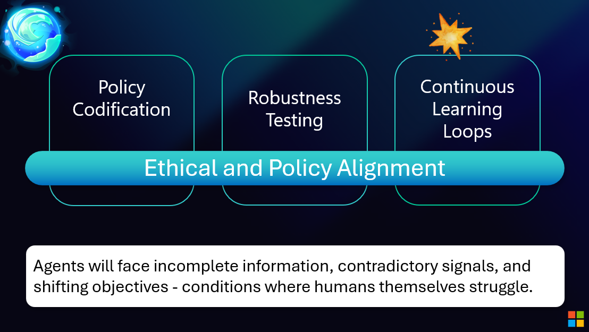

# Compliance


## Regulatory Landscape

Navigate the complex landscape of AI and data privacy regulations.



*Figure: Ethical policies guide compliance and responsible AI development*

## Major Regulations

### GDPR (General Data Protection Regulation)

**Scope**: EU citizens' data, regardless of where processing occurs

**Key Requirements**:

```python
class GDPRCompliance:
    """Implement GDPR compliance requirements."""

    REQUIREMENTS = {
        'lawful_basis': [
            'consent',
            'contract',
            'legal_obligation',
            'vital_interests',
            'public_task',
            'legitimate_interests'
        ],
        'user_rights': [
            'right_to_access',
            'right_to_rectification',
            'right_to_erasure',
            'right_to_restriction',
            'right_to_portability',
            'right_to_object',
            'rights_related_to_automated_decision_making'
        ],
        'obligations': [
            'privacy_by_design',
            'data_protection_impact_assessment',
            'data_breach_notification',
            'appointment_of_dpo',
            'record_of_processing_activities'
        ]
    }

    def verify_compliance(self, system_config: dict) -> dict:
        """Verify GDPR compliance."""
        checks = {
            'has_lawful_basis': self.check_lawful_basis(system_config),
            'implements_user_rights': self.check_user_rights(system_config),
            'has_dpo': 'dpo_contact' in system_config,
            'maintains_records': self.check_processing_records(system_config),
            'has_breach_procedures': 'breach_procedures' in system_config,
            'data_minimization': self.check_data_minimization(system_config),
            'privacy_by_design': self.check_privacy_by_design(system_config),
        }

        return {
            'regulation': 'GDPR',
            'compliant': all(checks.values()),
            'checks': checks,
            'missing_requirements': [k for k, v in checks.items() if not v]
        }
```

### CCPA (California Consumer Privacy Act)

**Scope**: California residents' data

**Key Requirements**:

```python
class CCPACompliance:
    """Implement CCPA compliance requirements."""

    def __init__(self):
        self.disclosure_categories = [
            'identifiers',
            'personal_info',
            'commercial_info',
            'biometric_info',
            'internet_activity',
            'geolocation',
            'sensory_data',
            'professional_info',
            'education_info',
            'inferences'
        ]

    async def handle_consumer_request(
        self,
        request_type: str,
        consumer_id: str
    ):
        """Handle CCPA consumer requests."""
        if request_type == 'know':
            return await self.right_to_know(consumer_id)
        elif request_type == 'delete':
            return await self.right_to_delete(consumer_id)
        elif request_type == 'opt_out':
            return await self.right_to_opt_out(consumer_id)
        elif request_type == 'non_discrimination':
            return await self.verify_non_discrimination(consumer_id)

    async def provide_notice_at_collection(self, consumer_id: str):
        """Provide notice at or before collection (CCPA requirement)."""
        return {
            'categories_collected': self.disclosure_categories,
            'purposes': [
                'Provide AI agent services',
                'Improve service quality',
                'Security and fraud prevention'
            ],
            'retention_period': '90 days for conversations',
            'third_parties': ['Azure OpenAI Service'],
            'consumer_rights': [
                'Right to know',
                'Right to delete',
                'Right to opt-out of sale',
                'Right to non-discrimination'
            ]
        }
```

### HIPAA (Health Insurance Portability and Accountability Act)

For AI agents handling health data:

```python
class HIPAACompliance:
    """Implement HIPAA compliance for health data."""

    PHI_IDENTIFIERS = [
        'names',
        'geographic_subdivisions',
        'dates',
        'phone_numbers',
        'fax_numbers',
        'email_addresses',
        'ssn',
        'medical_record_numbers',
        'health_plan_numbers',
        'account_numbers',
        'certificate_numbers',
        'vehicle_identifiers',
        'device_identifiers',
        'urls',
        'ip_addresses',
        'biometric_identifiers',
        'photos',
        'any_other_unique_identifier'
    ]

    def de_identify_phi(self, data: dict) -> dict:
        """De-identify PHI according to Safe Harbor method."""
        de_identified = data.copy()

        for identifier in self.PHI_IDENTIFIERS:
            if identifier in de_identified:
                de_identified[identifier] = '[REDACTED]'

        # Generalize dates to year only
        if 'date_of_birth' in de_identified:
            de_identified['birth_year'] = de_identified['date_of_birth'].year
            del de_identified['date_of_birth']

        return de_identified

    def verify_baa_requirements(self, vendor: str) -> bool:
        """Verify Business Associate Agreement requirements."""
        required_clauses = [
            'permitted_uses',
            'safeguards',
            'breach_reporting',
            'subcontractor_agreements',
            'access_termination',
            'return_or_destruction'
        ]

        return all(
            self.has_baa_clause(vendor, clause)
            for clause in required_clauses
        )
```

## Compliance Framework Implementation

### Compliance Monitoring System

```python
class ComplianceMonitor:
    """Continuously monitor compliance status."""

    def __init__(self):
        self.regulations = {
            'GDPR': GDPRCompliance(),
            'CCPA': CCPACompliance(),
            'HIPAA': HIPAACompliance(),
        }
        self.compliance_status = {}

    async def run_compliance_audit(self, system_config: dict) -> dict:
        """Run comprehensive compliance audit."""
        results = {}

        for regulation_name, compliance_checker in self.regulations.items():
            if regulation_name == 'GDPR':
                results[regulation_name] = compliance_checker.verify_compliance(
                    system_config
                )
            # Add other regulation checks

        # Generate compliance report
        report = self.generate_compliance_report(results)

        # Log audit
        await self.log_audit(report)

        return report

    def generate_compliance_report(self, results: dict) -> dict:
        """Generate comprehensive compliance report."""
        return {
            'audit_date': datetime.utcnow().isoformat(),
            'regulations_checked': list(results.keys()),
            'overall_compliant': all(
                r.get('compliant', False) for r in results.values()
            ),
            'details': results,
            'recommendations': self.generate_recommendations(results),
            'next_audit_date': (
                datetime.utcnow() + timedelta(days=90)
            ).isoformat()
        }
```

### Data Processing Agreements (DPA)

```python
class DPAManager:
    """Manage Data Processing Agreements with vendors."""

    def __init__(self):
        self.agreements = {}

    def register_dpa(
        self,
        vendor_name: str,
        dpa_details: dict
    ):
        """Register a Data Processing Agreement."""
        self.agreements[vendor_name] = {
            'vendor': vendor_name,
            'signed_date': datetime.utcnow(),
            'expiry_date': dpa_details.get('expiry_date'),
            'data_categories': dpa_details.get('data_categories', []),
            'processing_purposes': dpa_details.get('purposes', []),
            'security_measures': dpa_details.get('security_measures', []),
            'sub_processors': dpa_details.get('sub_processors', []),
            'international_transfers': dpa_details.get('transfers', []),
            'audit_rights': dpa_details.get('audit_rights', True),
        }

    def verify_vendor_compliance(self, vendor_name: str) -> dict:
        """Verify vendor meets DPA requirements."""
        if vendor_name not in self.agreements:
            return {'compliant': False, 'reason': 'No DPA on file'}

        dpa = self.agreements[vendor_name]

        checks = {
            'dpa_current': dpa['expiry_date'] > datetime.utcnow(),
            'security_measures_adequate': len(dpa['security_measures']) >= 5,
            'sub_processors_approved': self.verify_sub_processors(
                dpa['sub_processors']
            ),
            'transfers_legal': self.verify_international_transfers(
                dpa['international_transfers']
            ),
        }

        return {
            'vendor': vendor_name,
            'compliant': all(checks.values()),
            'checks': checks
        }
```

### Privacy Impact Assessment (PIA)

```python
class PrivacyImpactAssessment:
    """Conduct Privacy Impact Assessments."""

    def __init__(self):
        self.risk_levels = ['low', 'medium', 'high', 'critical']

    def conduct_pia(self, project: dict) -> dict:
        """Conduct Privacy Impact Assessment for new project."""
        assessment = {
            'project_name': project['name'],
            'assessment_date': datetime.utcnow().isoformat(),
            'assessor': project.get('assessor'),

            # Nature of processing
            'data_collected': project['data_collected'],
            'processing_purposes': project['purposes'],
            'data_subjects': project['data_subjects'],

            # Privacy risks identified
            'risks': self.identify_risks(project),

            # Mitigation measures
            'mitigations': self.propose_mitigations(project),

            # Compliance assessment
            'compliance_check': self.check_compliance(project),

            # Overall risk level
            'overall_risk': self.calculate_overall_risk(project),

            # Recommendations
            'recommendations': self.generate_recommendations(project),
        }

        return assessment

    def identify_risks(self, project: dict) -> list:
        """Identify privacy risks in the project."""
        risks = []

        # Check for high-risk indicators
        if 'sensitive_data' in project.get('data_collected', []):
            risks.append({
                'risk': 'Processing sensitive personal data',
                'level': 'high',
                'description': 'Special category data requires extra protection'
            })

        if project.get('automated_decisions'):
            risks.append({
                'risk': 'Automated decision-making',
                'level': 'high',
                'description': 'GDPR Article 22 applies'
            })

        if 'children' in project.get('data_subjects', []):
            risks.append({
                'risk': 'Processing children\'s data',
                'level': 'high',
                'description': 'Enhanced protections required'
            })

        return risks
```

### Compliance Documentation

```python
class ComplianceDocumentation:
    """Maintain compliance documentation."""

    def generate_ropa(self) -> dict:
        """
        Generate Record of Processing Activities (ROPA).
        Required by GDPR Article 30.
        """
        return {
            'organization': 'AI Agent Service',
            'dpo_contact': 'dpo@example.com',
            'processing_activities': [
                {
                    'name': 'AI Agent Conversations',
                    'purposes': [
                        'Provide AI assistant services',
                        'Service improvement'
                    ],
                    'data_categories': [
                        'User queries',
                        'Conversation history',
                        'User preferences'
                    ],
                    'data_subjects': ['Service users'],
                    'recipients': ['Azure OpenAI Service'],
                    'international_transfers': [
                        {
                            'country': 'USA',
                            'safeguards': 'Standard Contractual Clauses'
                        }
                    ],
                    'retention_period': '90 days',
                    'security_measures': [
                        'Encryption at rest and in transit',
                        'Access controls',
                        'Audit logging',
                        'Regular security assessments'
                    ]
                }
            ],
            'last_updated': datetime.utcnow().isoformat()
        }

    def generate_privacy_policy(self) -> str:
        """Generate privacy policy document."""
        return """
        Privacy Policy

        Last Updated: {date}

        1. Information We Collect
           - Information you provide directly
           - Usage information
           - Technical information

        2. How We Use Your Information
           - Provide and improve services
           - Communicate with you
           - Security and fraud prevention

        3. Data Sharing and Disclosure
           - Service providers
           - Legal requirements
           - Business transfers

        4. Your Privacy Rights
           - Access your data
           - Correct your data
           - Delete your data
           - Object to processing
           - Data portability

        5. Data Security
           - Technical and organizational measures
           - Encryption
           - Access controls

        6. Data Retention
           - Retention periods by data type
           - Deletion procedures

        7. International Data Transfers
           - Transfer mechanisms
           - Safeguards

        8. Children's Privacy
           - Age restrictions
           - Parental consent

        9. Changes to This Policy
           - Notification procedures

        10. Contact Us
            - Privacy inquiries: privacy@example.com
            - Data Protection Officer: dpo@example.com
        """.format(date=datetime.utcnow().strftime('%Y-%m-%d'))
```

## Compliance Checklist

- [ ] Identified applicable regulations
- [ ] Conducted Privacy Impact Assessment
- [ ] Implemented required user rights
- [ ] Established data retention policies
- [ ] Created privacy policy and notices
- [ ] Appointed Data Protection Officer (if required)
- [ ] Implemented data breach procedures
- [ ] Signed Data Processing Agreements with vendors
- [ ] Documented processing activities (ROPA)
- [ ] Established consent management
- [ ] Implemented security measures
- [ ] Set up compliance monitoring
- [ ] Trained staff on privacy requirements
- [ ] Scheduled regular compliance audits

<div class="resource-links">
<h3>📚 Microsoft Learn Resources</h3>
<ul>
<li><a href="https://learn.microsoft.com/microsoft-365/compliance/" target="_blank" rel="noopener">Microsoft Purview</a></li>
<li><a href="https://learn.microsoft.com/azure/compliance/" target="_blank" rel="noopener">Azure Compliance Documentation</a></li>
<li><a href="https://learn.microsoft.com/compliance/regulatory/gdpr" target="_blank" rel="noopener">GDPR Compliance in Azure</a></li>
<li><a href="https://www.microsoft.com/trust-center" target="_blank" rel="noopener">Microsoft Trust Center</a></li>
</ul>
<h3>📖 Additional Documentation</h3>
<ul>
<li><a href="https://gdpr.eu/" target="_blank" rel="noopener">GDPR Official Text</a></li>
<li><a href="https://oag.ca.gov/privacy/ccpa" target="_blank" rel="noopener">CCPA Regulations</a></li>
<li><a href="https://www.hhs.gov/hipaa/" target="_blank" rel="noopener">HIPAA Requirements</a></li>
<li><a href="https://www.iso.org/standard/71670.html" target="_blank" rel="noopener">ISO 27701 Privacy Standard</a></li>
<li><a href="https://www.nist.gov/privacy-framework" target="_blank" rel="noopener">NIST Privacy Framework</a></li>
</ul>
</div>
