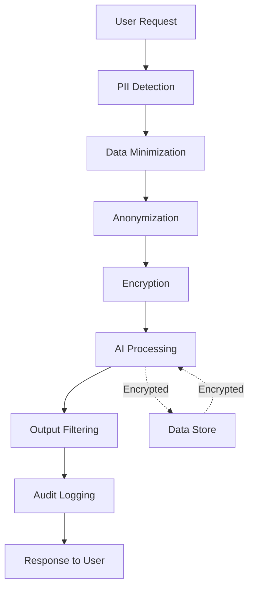

# Privacy & Data Protection


## Introduction

Privacy and data protection are fundamental to building trustworthy AI agents. Users entrust their personal information, conversations, and data to your system—protecting that trust is not just a legal requirement, it's an ethical imperative.

## Why Privacy Matters for AI Agents

AI agents present unique privacy challenges:

- **Conversational Data**: Storing and processing personal conversations
- **Context Retention**: Maintaining history while respecting privacy
- **Data Aggregation**: Combining data from multiple sources
- **Third-party Integration**: Sharing data with external services
- **Model Training**: Using user data to improve models

## Core Privacy Principles

### 1. Data Minimization

Collect only what you need:

```python
class DataMinimization:
    """Implement data minimization principles."""

    @staticmethod
    def collect_essential_data(user_request: dict) -> dict:
        """
        Extract only essential data from user request.
        """
        essential_fields = [
            'user_id',
            'query',
            'timestamp'
        ]

        # Only keep essential fields
        minimized_data = {
            field: user_request.get(field)
            for field in essential_fields
            if field in user_request
        }

        return minimized_data

    @staticmethod
    def anonymize_logs(log_entry: dict) -> dict:
        """
        Remove or hash identifying information from logs.
        """
        import hashlib

        anonymized = log_entry.copy()

        # Hash user IDs
        if 'user_id' in anonymized:
            anonymized['user_id'] = hashlib.sha256(
                anonymized['user_id'].encode()
            ).hexdigest()[:16]

        # Remove PII
        pii_fields = ['email', 'phone', 'address', 'name']
        for field in pii_fields:
            if field in anonymized:
                anonymized[field] = '[REDACTED]'

        return anonymized
```

### 2. Purpose Limitation

Use data only for stated purposes:

```python
from enum import Enum
from typing import Set

class DataPurpose(Enum):
    SERVICE_DELIVERY = "service_delivery"
    ANALYTICS = "analytics"
    MODEL_IMPROVEMENT = "model_improvement"
    MARKETING = "marketing"

class PurposeLimitation:
    """Enforce purpose limitation for data usage."""

    def __init__(self):
        # Track consents per user
        self.user_consents = {}

    def record_consent(
        self,
        user_id: str,
        purposes: Set[DataPurpose]
    ):
        """Record user consent for data purposes."""
        self.user_consents[user_id] = {
            'purposes': purposes,
            'timestamp': datetime.utcnow(),
            'version': '1.0'
        }

    def check_purpose(
        self,
        user_id: str,
        intended_purpose: DataPurpose
    ) -> bool:
        """
        Check if user has consented to data use for purpose.
        """
        if user_id not in self.user_consents:
            return False

        consented_purposes = self.user_consents[user_id]['purposes']
        return intended_purpose in consented_purposes

    def use_data(
        self,
        user_id: str,
        data: dict,
        purpose: DataPurpose
    ) -> bool:
        """
        Use data only if user has consented for the purpose.
        """
        if not self.check_purpose(user_id, purpose):
            raise PrivacyViolation(
                f"User {user_id} has not consented to {purpose.value}"
            )

        # Log the data usage
        self.log_data_usage(user_id, purpose)
        return True
```

### 3. Transparency

Be clear about data practices:

```python
class PrivacyNotice:
    """Generate clear privacy notices."""

    @staticmethod
    def generate_notice(
        data_collected: list,
        purposes: list,
        retention_period: str,
        third_parties: list
    ) -> dict:
        """
        Generate a clear privacy notice.
        """
        return {
            "what_we_collect": {
                "data_types": data_collected,
                "examples": [
                    "Your questions and requests",
                    "Usage patterns and preferences",
                    "Account information"
                ]
            },
            "why_we_collect": {
                "purposes": purposes,
                "explanations": {
                    "service_delivery": "To provide AI agent responses",
                    "improvement": "To improve our service quality",
                    "security": "To protect against abuse"
                }
            },
            "how_long": {
                "retention_period": retention_period,
                "details": "Data is automatically deleted after this period"
            },
            "who_we_share_with": {
                "third_parties": third_parties,
                "safeguards": "All third parties are contractually bound to protect your data"
            },
            "your_rights": [
                "Access your data",
                "Correct inaccurate data",
                "Delete your data",
                "Object to processing",
                "Data portability"
            ],
            "contact": "privacy@example.com"
        }
```

### 4. User Control

Give users control over their data:

```python
class UserDataControl:
    """Implement user rights and controls."""

    def __init__(self, storage):
        self.storage = storage

    async def export_user_data(self, user_id: str) -> dict:
        """
        Export all user data (right to data portability).
        """
        user_data = await self.storage.get_all_user_data(user_id)

        return {
            "user_id": user_id,
            "export_date": datetime.utcnow().isoformat(),
            "data": {
                "profile": user_data.get("profile"),
                "conversations": user_data.get("conversations"),
                "preferences": user_data.get("preferences"),
                "consent_history": user_data.get("consents")
            }
        }

    async def delete_user_data(self, user_id: str):
        """
        Delete all user data (right to be forgotten).
        """
        # Delete from all storage locations
        await self.storage.delete_user_conversations(user_id)
        await self.storage.delete_user_profile(user_id)
        await self.storage.delete_user_preferences(user_id)

        # Log the deletion
        await self.storage.log_deletion(user_id, datetime.utcnow())

        # Notify dependent systems
        await self.notify_deletion(user_id)

    async def correct_user_data(
        self,
        user_id: str,
        corrections: dict
    ):
        """
        Allow user to correct their data (right to rectification).
        """
        await self.storage.update_user_data(user_id, corrections)

        # Log the correction
        await self.storage.log_correction(
            user_id,
            corrections,
            datetime.utcnow()
        )

    async def restrict_processing(
        self,
        user_id: str,
        restrictions: list
    ):
        """
        Restrict data processing (right to restriction).
        """
        await self.storage.set_processing_restrictions(
            user_id,
            restrictions
        )
```

## Privacy by Design

Build privacy into your architecture:



### PII Detection and Redaction

```python
import re
from typing import Tuple, List

class PIIDetector:
    """Detect and redact personally identifiable information."""

    def __init__(self):
        self.patterns = {
            'email': r'\b[A-Za-z0-9._%+-]+@[A-Za-z0-9.-]+\.[A-Z|a-z]{2,}\b',
            'phone': r'\b\d{3}[-.]?\d{3}[-.]?\d{4}\b',
            'ssn': r'\b\d{3}-\d{2}-\d{4}\b',
            'credit_card': r'\b\d{4}[-\s]?\d{4}[-\s]?\d{4}[-\s]?\d{4}\b',
            'ip_address': r'\b\d{1,3}\.\d{1,3}\.\d{1,3}\.\d{1,3}\b',
        }

    def detect_pii(self, text: str) -> List[Tuple[str, str]]:
        """
        Detect PII in text.

        Returns:
            List of (pii_type, matched_value) tuples
        """
        detected = []

        for pii_type, pattern in self.patterns.items():
            matches = re.finditer(pattern, text)
            for match in matches:
                detected.append((pii_type, match.group()))

        return detected

    def redact_pii(self, text: str, replacement: str = "[REDACTED]") -> str:
        """
        Redact PII from text.
        """
        redacted = text

        for pii_type, pattern in self.patterns.items():
            redacted = re.sub(pattern, replacement, redacted)

        return redacted

    def tokenize_pii(self, text: str) -> Tuple[str, dict]:
        """
        Replace PII with tokens that can be reversed.

        Returns:
            (tokenized_text, token_map)
        """
        import uuid

        tokenized = text
        token_map = {}

        for pii_type, pattern in self.patterns.items():
            matches = re.finditer(pattern, text)
            for match in matches:
                token = f"[{pii_type.upper()}_{uuid.uuid4().hex[:8]}]"
                token_map[token] = match.group()
                tokenized = tokenized.replace(match.group(), token, 1)

        return tokenized, token_map
```

## Data Retention and Deletion

Implement appropriate retention policies:

```python
from datetime import datetime, timedelta

class DataRetentionPolicy:
    """Implement data retention and deletion policies."""

    def __init__(self):
        self.retention_periods = {
            'conversation_history': timedelta(days=90),
            'analytics_data': timedelta(days=365),
            'audit_logs': timedelta(days=2555),  # 7 years
            'user_profiles': None,  # Until user deletion
        }

    async def apply_retention_policy(self):
        """
        Apply retention policy and delete expired data.
        """
        for data_type, retention_period in self.retention_periods.items():
            if retention_period is None:
                continue

            cutoff_date = datetime.utcnow() - retention_period

            # Find and delete expired data
            expired_data = await self.storage.find_expired_data(
                data_type,
                cutoff_date
            )

            for item in expired_data:
                await self.delete_with_verification(item)

    async def delete_with_verification(self, item: dict):
        """
        Delete data with verification and logging.
        """
        # Log before deletion
        await self.log_deletion_intent(item)

        # Perform deletion
        await self.storage.delete(item['id'])

        # Verify deletion
        deleted = await self.storage.get(item['id']) is None

        if deleted:
            await self.log_deletion_success(item)
        else:
            await self.log_deletion_failure(item)
            raise DeletionError(f"Failed to delete {item['id']}")
```

## Privacy-Preserving Techniques

### Differential Privacy

Add noise to protect individual privacy:

```python
import numpy as np

class DifferentialPrivacy:
    """Implement differential privacy for analytics."""

    def __init__(self, epsilon: float = 1.0):
        """
        Initialize with privacy budget.

        Args:
            epsilon: Privacy budget (lower = more privacy)
        """
        self.epsilon = epsilon

    def add_laplace_noise(self, value: float, sensitivity: float) -> float:
        """
        Add Laplace noise for differential privacy.

        Args:
            value: True value
            sensitivity: How much one record can change the result
        """
        scale = sensitivity / self.epsilon
        noise = np.random.laplace(0, scale)
        return value + noise

    def private_count(self, count: int) -> int:
        """
        Return differentially private count.
        """
        # Sensitivity of count is 1
        noisy_count = self.add_laplace_noise(float(count), sensitivity=1.0)
        return max(0, int(round(noisy_count)))

    def private_mean(self, values: list, value_range: tuple) -> float:
        """
        Return differentially private mean.
        """
        if not values:
            return 0

        # Clip values to range
        min_val, max_val = value_range
        clipped = [max(min_val, min(max_val, v)) for v in values]

        # Sensitivity is (max - min) / n
        sensitivity = (max_val - min_val) / len(clipped)

        true_mean = np.mean(clipped)
        return self.add_laplace_noise(true_mean, sensitivity)
```

### Homomorphic Encryption

Compute on encrypted data:

```python
# This is a conceptual example - use a proper library in production
class HomomorphicEncryption:
    """
    Conceptual example of homomorphic encryption.
    In production, use libraries like TenSEAL or Microsoft SEAL.
    """

    def encrypt(self, value: int) -> 'EncryptedValue':
        """Encrypt a value."""
        # In reality, use proper HE library
        pass

    def add_encrypted(
        self,
        encrypted1: 'EncryptedValue',
        encrypted2: 'EncryptedValue'
    ) -> 'EncryptedValue':
        """Add two encrypted values without decrypting."""
        pass

    def decrypt(self, encrypted: 'EncryptedValue') -> int:
        """Decrypt a value."""
        pass
```

## Compliance Framework

```python
class ComplianceChecker:
    """Check compliance with privacy regulations."""

    def __init__(self):
        self.regulations = ['GDPR', 'CCPA', 'PIPEDA', 'LGPD']

    def check_gdpr_compliance(self, system_config: dict) -> dict:
        """
        Check GDPR compliance.
        """
        checks = {
            'lawful_basis': self.has_lawful_basis(system_config),
            'consent_management': self.has_consent_management(system_config),
            'data_protection_officer': self.has_dpo(system_config),
            'privacy_by_design': self.implements_privacy_by_design(system_config),
            'data_breach_procedures': self.has_breach_procedures(system_config),
            'user_rights': self.supports_user_rights(system_config),
            'international_transfers': self.handles_transfers_correctly(system_config),
        }

        compliant = all(checks.values())

        return {
            'regulation': 'GDPR',
            'compliant': compliant,
            'checks': checks,
            'missing': [k for k, v in checks.items() if not v]
        }
```

## Next Steps

Explore detailed privacy topics:

- [Data Governance](data-governance.md)
- [User Privacy](user-privacy.md)
- [Compliance](compliance.md)

<div class="resource-links">
<h3>📚 Microsoft Learn Resources</h3>
<ul>
<li><a href="https://learn.microsoft.com/azure/compliance/offerings/" target="_blank" rel="noopener">Azure Privacy Documentation</a></li>
<li><a href="https://learn.microsoft.com/azure/security/fundamentals/data-encryption-best-practices" target="_blank" rel="noopener">Data Protection in Azure</a></li>
<li><a href="https://learn.microsoft.com/azure/confidential-computing/" target="_blank" rel="noopener">Azure Confidential Computing</a></li>
<li><a href="https://www.microsoft.com/trust-center/privacy" target="_blank" rel="noopener">Microsoft Privacy Principles</a></li>
<li><a href="https://learn.microsoft.com/azure/machine-learning/concept-responsible-ai" target="_blank" rel="noopener">Responsible AI Privacy</a></li>
</ul>
<h3>📖 Additional Documentation</h3>
<ul>
<li><a href="https://gdpr.eu/" target="_blank" rel="noopener">GDPR Compliance</a></li>
<li><a href="https://oag.ca.gov/privacy/ccpa" target="_blank" rel="noopener">CCPA Requirements</a></li>
<li><a href="https://www.nist.gov/privacy-framework" target="_blank" rel="noopener">NIST Privacy Framework</a></li>
<li><a href="https://www.iso.org/standard/71670.html" target="_blank" rel="noopener">ISO 27701 Privacy Standard</a></li>
</ul>
</div>
